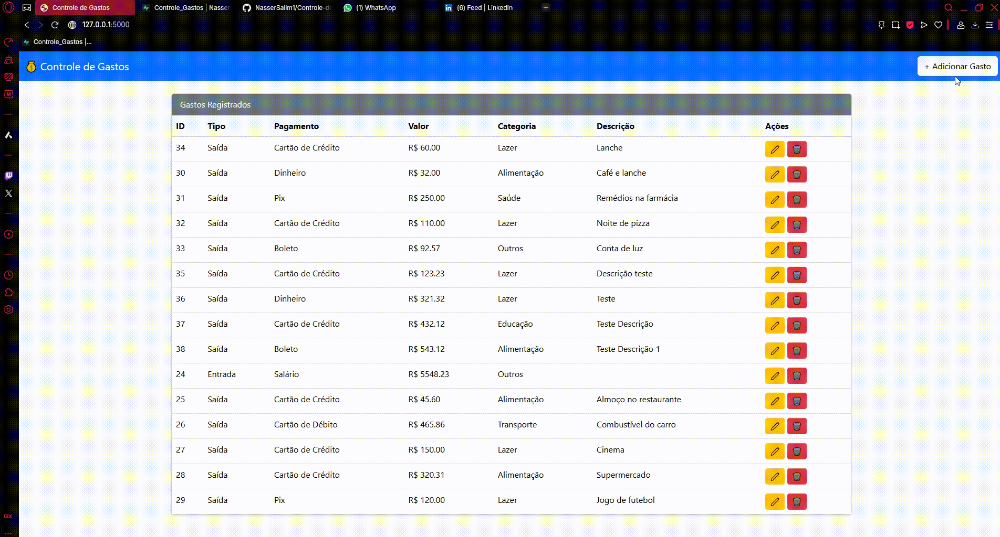

# 💸 Controle de Gastos - Web App (Flask + Supabase + Bootstrap)

🛠️ Sobre o Projeto
Este projeto demonstra como integrar uma base de dados Supabase (PostgreSQL) ao Power BI Free, utilizando chamadas à API REST do Supabase para carregar dados de forma segura e eficiente.
A tabela de exemplo utilizada é chamada gastos.
---

🎥 

---

## 🚀 Funcionalidades

- 📋 Visualizar todos os registros de gastos
- ➕ Adicionar novos gastos
- ✏️ Editar registros existentes
- ❌ Excluir registros
- 📊 Integrável com Power BI para relatórios dinâmicos

---

## 🧰 Tecnologias Utilizadas

- [Python 3.10+](https://www.python.org/)
- [Flask](https://flask.palletsprojects.com/)
- [Supabase (PostgreSQL)](https://supabase.com/)
- [Bootstrap 5](https://getbootstrap.com/)
- [Power BI](https://powerbi.microsoft.com/) 

## 📚 Bibliotecas Python

- requests — Para fazer chamadas HTTP à API do Supabase.
- pandas — Para manipulação e análise de dados (opcional, se usado).
- supabase-py — (Se você usou a SDK oficial do Supabase no Python.)

---

## 🔗 Configuração da Conexão

### 1. Informações necessárias

- **URL do Projeto**:  
  `https://dirdlupkocponlqfiulq.supabase.co`
  
- **Nome da Tabela**:  
  `gastos`
  
- **Anon Public Key (API Key)**:  
  Obtida no painel do Supabase: **Settings → API → Anon Key**.

### 2. Montagem da URL para a API

Formato: https://<projeto>.supabase.co/rest/v1/<nome-da-tabela>

### 3. Conectando no Power BI

1. No Power BI Desktop:
   - Clique em **Obter Dados** → **Web**.
   - Escolha a opção **Avançado**.

2. Preencha:
   - **URL Base**: `https://dirdlupkocponlqfiulq.supabase.co/rest/v1/gastos`
   
3. **Adicione dois cabeçalhos HTTP**:
   
| Nome | Valor |
| :--- | :--- |
| `apikey` | `SUA_ANON_KEY` |
| `Authorization` | `Bearer SUA_ANON_KEY` |

*(Substituir `SUA_ANON_KEY` pela chave que você pegou no Supabase.)*

4. Clique em **OK** e aguarde o carregamento dos dados.
